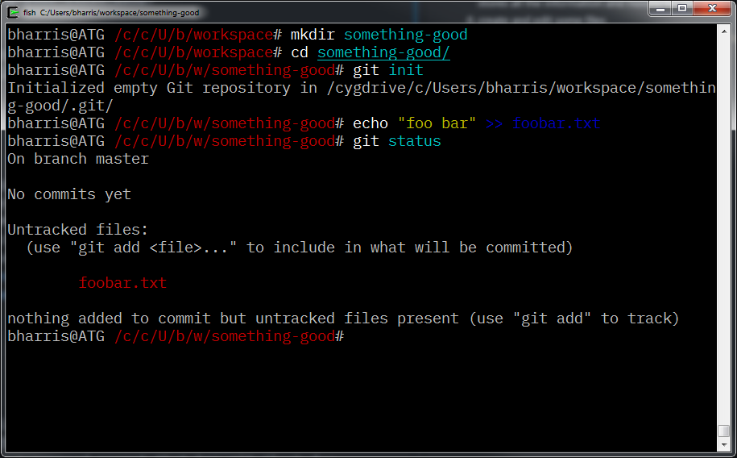
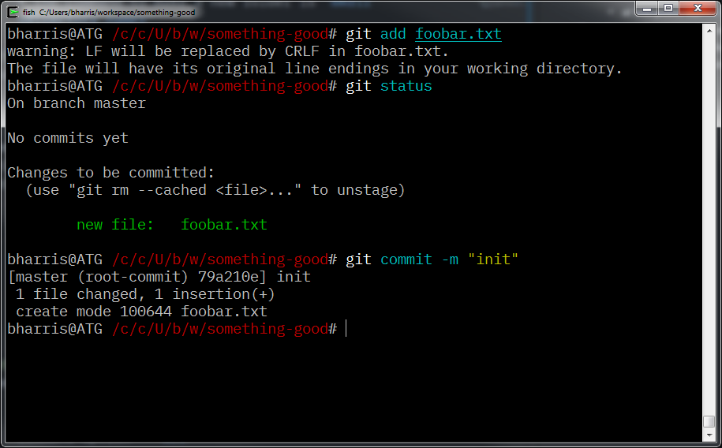

# learngit

this is a getting started guide to [`git`](https://git-scm.com).

# table of contents

* **[home](README.md)**
    * [getting set up](#getting-set-up)
    * [making your first repo](#making-your-first-repo)
    * [syncing your changes with others](#syncing-your-changes-with-others)
* [glossary](glossary.md)
* [common commands](common_commands.md)
* [branching strategies](branching_strategies.md)
* [troubleshooting](troubleshooting.md)
* [ssh setup](ssh_setup.md)
* [external resources](#external-resources)

# here we go!

this is not meant to be a complete guide to git. just some notes that i've gathered over the years of using git that might be helpful to share with others.

## getting set up

1. download [`git`](https://git-scm.com) and install it.
1. windows: open git bash (or any command prompt if you chose to install git system-wide) all other systems: open a terminal of your choice
1. make sure that the install worked correctly by typing `git --version`
1. configure git with your name and email address:
    * `git config --global user.name "Your Name Here"`
    * `git config --global user.email "youremail@domain.tld"`

you're ready to `git` gud!

## making your first repo

1. create a new, empty folder ([directory](glossary.md#directory) in git and unix speak)
    * the command to make a new folder is `mkdir <directory_name>`
1. open or move to that folder in a command prompt that has git (look for git bash in the start menu if you're having trouble with this one)
    * the command to move between directories is `cd <directory_name>`
1. once you're in that directory, execute `git init`. this command creates a `.git` folder inside the current folder, which is where `git` stores all the information and history for the repo.
1. create and edit some files
    * for example: `echo "foo bar" >> foobar.txt`
1. check `git status` you should see something like this:
    
    * at this point, our [working tree](glossary.md#working-tree) is ["dirty"](glossary.md#dirty), meaning that there are unsaved changes in the directory.
1. at this point, you need to add the changes to the [staging area](glossary.md#staging-area) with the `git add` command
    * you can add individual files by name (`git add foobar.txt`) or all changes to the working tree with the command option `--all`
1. once the files are staged, you are now ready to [`commit`](common_commands.md#commit) the changes. every commit requires a message, which can be specified with the `-m` option. if you don't give a message with the [`commit`](common_commands.md#commit) command, `git` will open your file editor and ask you to enter one.
    

now you have a repo with one commit in it!

## syncing your changes with others

now we get to have the real fun. the whole point of a distributed version control system is to allow many people to be working on the same code at once.

there are many ways to collaborate on a `git` repo. the simplest way to share a repo is to use the `--bare` option with the [`init`](common_commands.md#init) command.

> bare repos are generally stored on a server that all users have SSH access to: once the repo is created on the server, each person can [`clone`](common_commands.md#clone) a copy to their local machine like this: `git clone user@servername:path/to/repo`

otherwise, there are dozens of git hosting options, the most popular of which is [github](https://github.com), which hosts the majority of all open source projects.

let's take a look at syncing your repo with github (or any other git hosting location - just swap out the URLs).

1. [create the repo](https://github.com/new)
1. set up the [`remote`](glossary.md#remote)s
    * this depends on whether you have already created the repository locally. once you have created the repo on github, it will display some tips for which commands to use
    * for an existing repo: `git remote add origin git@github.com:username/reponame` OR `git remote add origin https://github.com/username/reponame` depending on your [SSH key setup](ssh_setup.md)
    * if the repo doesn't exist yet, [`clone`](common_commands.md#clone) the repo like this: `git clone git@github.com:username/reponame`
    * a repo can have and use more than one remote. you can see the current remotes with this command: `git remote -v`
1. before you can sync you changes, there needs to be at least one commit in the repo (not a problem for pre-existing repos). create one now if you haven't.
1. now you can [`push`](common_commands.md#push) your commit history to the remote repo! use this command: `git push origin --all` to push all branches and commits to the remote (assuming that the remote is named `origin`)

to get changes that have other people have pushed the the repo while you were away, use the [`fetch`](common_commands.md#fetch) and [`merge`](common_commands.md#merge) commands. since this is such a common operation, [`pull`](common_commands.md#pull) was created as a shortcut for `git fetch` immediately followed by `git merge`.

if you haven't made any changes since the last time you `pull`ed the latest changes, it's usually a good idea to [`rebase`](common_commands.md#pull). this will replay all of the work that has been done on top of the current repo state, avoiding extra merge commits in the repo history. just use `git pull --rebase`.

---

## external resources
so you want to learn more?
here are some more resources!

* [progit book](https://git-scm.com/book/en/v2)
* [github interactive tutorial](https://try.github.io)
* [learn enough git to be dangerous](https://www.learnenough.com/git-tutorial)
* [atlassian git tutorials](https://www.atlassian.com/git/tutorials)
* [github documentation](https://help.github.com)
* [sourcetree app](https://sourcetreeapp.com) (a visual GUI tool for working with git repos: great for people who don't feel quite at home on the command line)
* [github desktop](https://desktop.github.com) (an alternate GUI by github)

