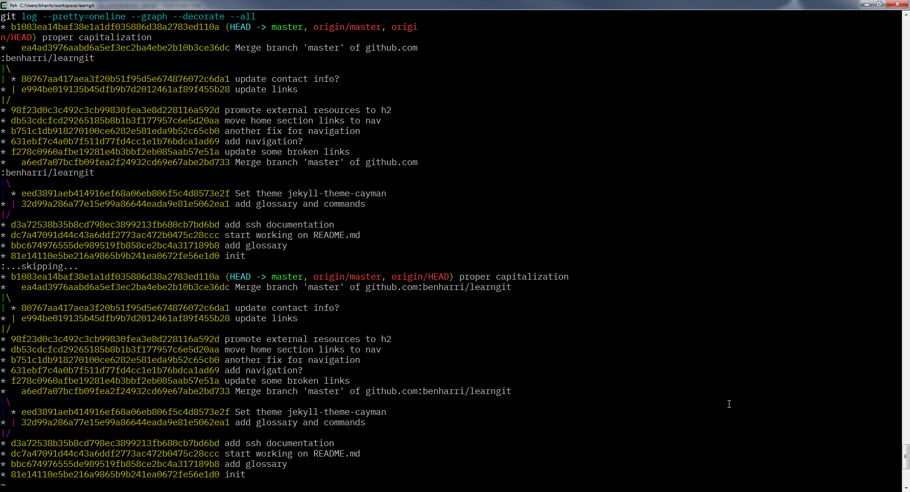

# common git commands

These are commands and options that I use frequently. See the linked documentation for more options and information.

---


## [add](https://git-scm.com/docs/git-add)
> `git add [--all] [<files>]`

Add files from the working tree to the staging area. [`commit`](#commit) operates on the staging area.

Try interactive staging: `git add -i`


## [branch](https://git-scm.com/docs/git-commit)
> `git branch [<branch>]`

Show branches and create new ones.


## [checkout](https://git-scm.com/docs/git-checkout)
> `git checkout [<branch>]`

Switch branches or restore working tree files.

The `-b` switch creates the branch if it doesn't exist and switches to it.


## [clone](https://git-scm.com/docs/git-clone)
> `git clone [<remote_url>] [directory_to_clone_into]`

Download a copy of a remote repository from a server.


## [commit](https://git-scm.com/docs/git-commit)
> `git commit [-a] [-m "commit message here"]`

Create a snapshot of the staging area. Record staged changes.

The `-a` switch will add all modified and deleted files (will not pick up new files that have been added to the repo) to the staging area before committing.


## [diff](https://git-scm.com/docs/git-diff)
> `git diff [<from_path-spec>]..[<to_path-spec>]`

Show changes by line. With no arguments, `diff` shows all unstaged changes.

Other uses would be comparing changes between branches or between a range of commits (referred to by their hashes, which you can see with [`log`](#log)).


## [fetch](https://git-scm.com/docs/git-fetch)
> `git fetch [<repository> [<refspec>]]`

Download objects and refs from another (usually remote) repository.


## [init](https://git-scm.com/docs/git-init)
> `git init [--bare] [--shared] [<directory>]`

Create an empty repo or reinitialize an existing one.


## [log](https://git-scm.com/docs/git-log)
> `git log [<revision range>]`

Show commit logs. There are a lot of options here. Check out the documentation.

Here are some of the log options that I use often. Some tips were taken from [git-tips](https://github.com/git-tips/tips)

All commits since forking from master
* `git log --no-merges --stat --reverse master..`

Visualize the history as a tree
* `git log --pretty=oneline --graph --decorate --all`



List changes specific to a certain file
* `git log --follow -p -- <file_path>`


## [merge](https://git-scm.com/docs/git-merge)
> `git merge [<branch>]`

Join two or more development histories together.

`merge` incorporates changes from the named commits provided as arguments into the current branch.

Sometimes you will have changed the same line as someone else. This will result in a merge conflict. Some GUI clients have tools to help resolve merge conflicts, but it is good to know how to do it manually.

```
Here are lines that are either unchanged from the common
ancestor, or cleanly resolved because only one side changed.
<<<<<<< yours:sample.txt
Conflict resolution is hard;
let's go shopping.
=======
Git makes conflict resolution easy.
>>>>>>> theirs:sample.txt
And here is another line that is cleanly resolved or unmodified.
```
* This is what you will see as the result of a merge conflict. Simply keep the lines you would like, remove the conflict markers, and commit the result.

See the documentation for more info on how to resolve merge conflicts.


## [pull](https://git-scm.com/docs/git-pull)
> `git pull [--rebase] [--ff] [--no-ff] [<remote name>] [<branch name>]`

`pull` is a synonym for [`fetch`](#fetch) followed immediately by a [`merge`](#merge). It's a nice shortcut for that.

Use the `--rebase` option when you haven't made any changes and want to get the latest changes that others have pushed to the remote.

To sync with remote and overwrite local changes:
> `git fetch origin && git reset --hard origin/master && git clean -f -d`


## [push](https://git-scm.com/docs/git-push)
> `git push [-u] [<remote name>] [<branch name>]`

The `-u` option will set the following branch and remote to the default upstream. This means you can simply do `git pull` without the [refspec](glossary.md#refspec).


